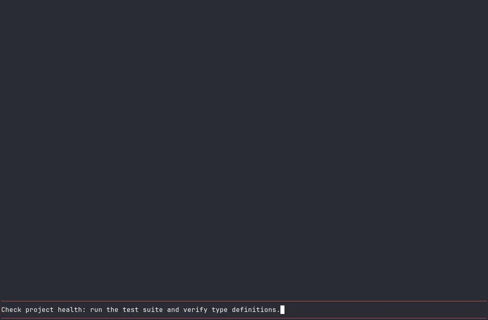

# pi-codemode-compact

A compact single-line summary renderer for [Pi Coding Agent](https://github.com/earendil-works/pi)'s `codemode` tool.

> I love `codemode` and run it with `codemode.mode: "only"`, but the default multi-line renderer took up way too much precious vertical screen space on every turn. So I vibe-coded this to reclaim my terminal.

**pi-codemode-compact** leaves execution, sandboxing, and LLM context completely untouched while compacting the interactive terminal display into clean, information-dense single-line rows (collapsed call and result rows take 1 line each; stacked into 2 lines total upon completion):

```text
Call:    codemode todo, write, bash · 118 lines
Result:  ✓ todo, write, bash · 4 lines · 0.1s · $0.02
Error:   ✗ write — TypeError: tools.foo is not a function
```

Pressing **Ctrl+O** expands the row to inspect the full syntax-highlighted script, per-call timings, models cost breakdown, errors, and complete output.

---

## Comparison

| Default `codemode` (10–20+ lines) | With `pi-codemode-compact` (2 lines) |
| :---: | :---: |
|  |  |

---

## Features

- **Space-Saving**: Replaces 10–20 rows of `codemode` output with a clean 2-line summary.
- **Key Metrics at a Glance**: Tools used, line count, execution time, and LLM cost (`$cost`).
- **Fully Expandable**: Press **Ctrl+O** anytime to inspect the full script source and raw output.

---

## Requirements

- **Pi Coding Agent**: `>= 1.0.1` (for `pi.registerToolRenderer()`, which replaced the earlier Proxy-based wiring)

---

## Installation

```bash
pi install npm:pi-codemode-compact
```

---

## How It Works

**pi-codemode-compact** registers a tool renderer resolver with `pi.registerToolRenderer()`. Pi asks the resolver how to draw each tool call, and the extension supplies compact `renderCall`/`renderResult` renderers only for `codemode`; every other tool falls through to Pi's own renderers via `next()`.

The built-in `codemode` definition — execution, sandbox, models API, store persistence — is never re-registered or replaced, so there is no startup replacement warning and no mid-session tool redefinition. Because the renderer attaches by tool name, it also applies when another extension or SDK factory registers `codemode` with different options, and in HTML exports.

---

## Known Limitations

- **Static Analysis Approximation**: The call line preview uses regex-based static scanning. Dynamic property accesses (`tools[fn]`), template-literal interpolations (`${tools.x}`), and regex literals containing tool accesses (`/tools.read/g`) may be omitted or yield false positives. The result line always displays the authoritative runtime execution history once finished.

---

## License

MIT
